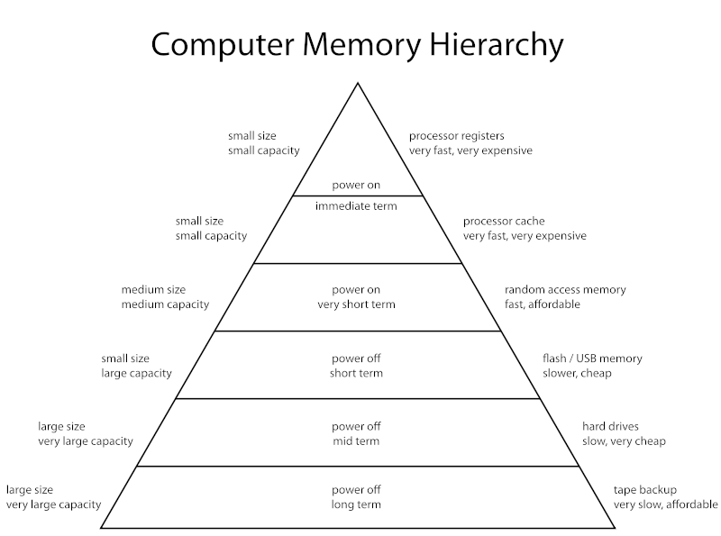

== Registers

=== Examples of registers

|===
| `rax` | `rbx`
| `rcx` | `rdx`
| `rsi` | `rdi`
| `rsp` | `rbp`
| `r8` - `r15` |
|===

=== Usage of registers

[source,x86asm]
----
mov    eax,0x0       <1>
----
<1> `eax` is the lowest 32-bits of `rax`
