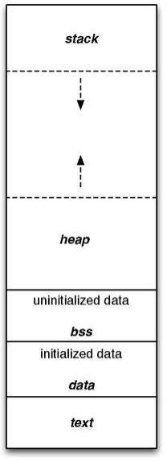

== Subroutines

[source,asm]
----
main:
    push rbp          ; <1>
    mov rbp, rsp

    mov rdi, message
    call printf
    mov rax, 0        ; <2>

    leave             ; <3>
    ret
----
<1> prologue
<2> `rax` is the return-value register
<3> epilogue

=== How do `call` and `ret` work?

=== Attempt #1: saving the instruction pointer

[source,asm]
----
mov rdi, 10
mov rsi, 1
mov rbx, rip
jmp add_without_ret
----

=== Attempt #2: saving the instruction pointer + an offset

[source,asm]
----
mov rdi, 10
mov rsi, 1
mov rbx, rip
add rbx, 10; 5 for the add instruction + 5 for the jmp instruction.
jmp add_without_ret
----

=== Attempt #3: saving an address

// TODO: adjust the lines.
[source,asm]
----
include::examples/4_subroutine.asm[lines=97..101]
----

=== Attempt #3: does it always work?

[source,asm]
----
include::examples/4_subroutine.asm[lines=150..154]
----

=== Attempt #3: factorial example

[source,asm,highlight='10']
----
include::examples/4_subroutine.asm[lines=53..75]
----

=== Attempt #3: failed

[source]
----
terminated by signal SIGBUS (Misaligned address error)
----

=== Solution

[source,asm]
----
include::examples/4_subroutine.asm[lines=107..111]
----
<1> `call` does the same: push the return address on the stack and jump to the label

[source,asm]
----
include::examples/4_subroutine.asm[lines=22..26]
----
<1> `ret` does the same: pop the return address from the stack and jump to it

=== Parameter passing

=== Attempt #1: reserve space in the code

[source,asm]
----
    jmp call_add
param1: dq 40
param2: dq 2
call_add:
    call add
----

=== Attempt #2: reserve space in the data section

[source,asm]
----
include::examples/4_subroutine.asm[lines=137..147]
----

=== Attempt #2: calling with static parameters

[source,asm]
----
include::examples/4_subroutine.asm[lines=126..128]
----

=== Attempt #3: passing parameters in registers

[source,asm]
----
include::examples/4_subroutine.asm[lines=12..15]
----

[source,asm]
----
include::examples/4_subroutine.asm[lines=81..83]
----

=== Solution: registers + the rest on the stack

Calling Conventions

|===
| Function call on Linux x86-64 | System call on Linux x86-64

| `rsi`, `rdi`, `rcx`, `rdx`, `r8`, `r9`

The next parameters on the stack in right-to-left order.

| `rdi`, `rsi`, `rdx`, `r10`, `r8`, `r9`
|===

=== Solution: registers + the rest on the stack

What do we do for functions calling other functions?

=== Stack allocation

=== How to do stack allocation?

[source,asm]
----
include::examples/4_subroutine.asm[lines=156..159]
----
<1> `rbp` is callee-save

=== The role of the registers `rbp` and `rsp`

image::images/stackframe1.png[Stack Frame]

=== Initialize an array

[source,asm]
----
include::examples/4_subroutine.asm[lines=161..172]
----
<1> The stack grows toward low addresses, hence using `add` and not `sub`.

=== Loop over an array

[source,asm]
----
include::examples/4_subroutine.asm[lines=174..189]
----

=== Array indexing

[source,asm]
----
include::examples/4_subroutine.asm[lines=214..224]
----

=== Stack deallocation

[source,asm]
----
include::examples/4_subroutine.asm[lines=191..192]
----
<1> Moves `rbp` into `rsp` and pop from the stack into `rbp`.
